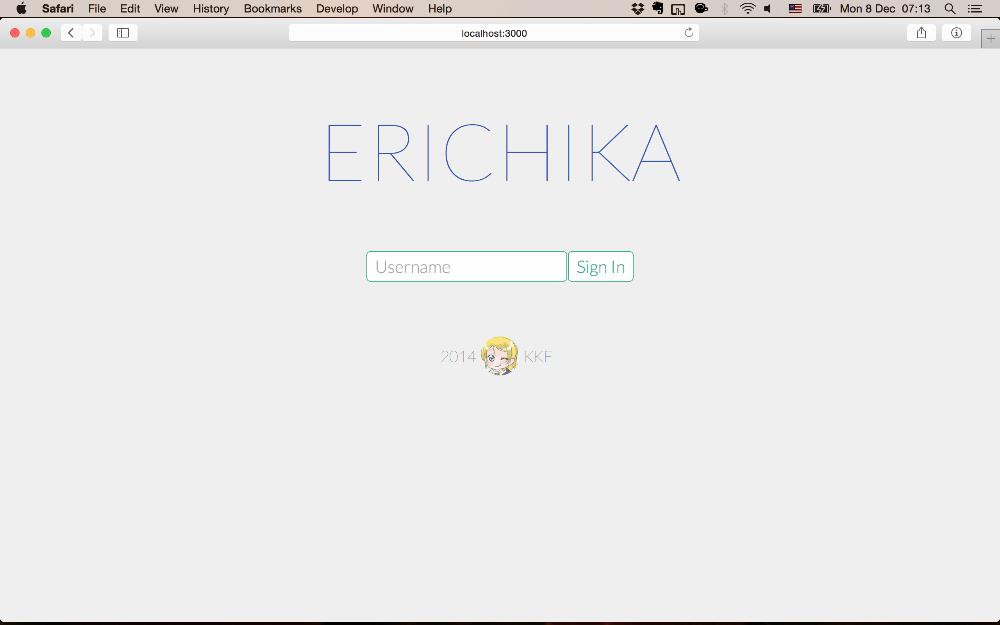
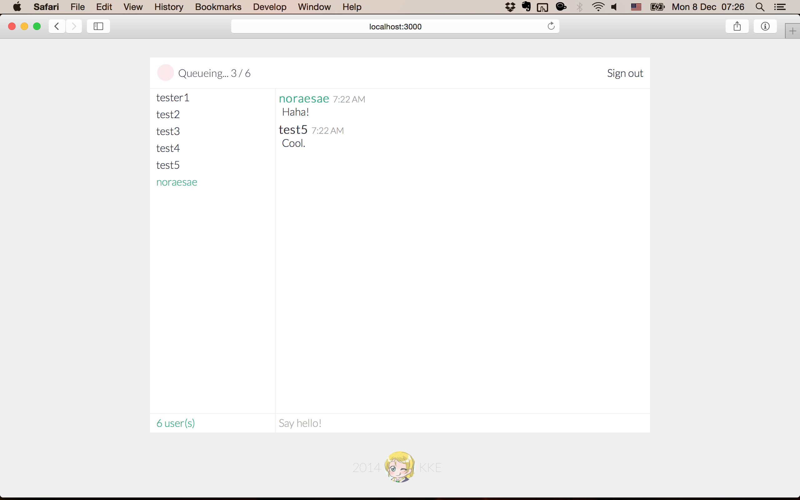
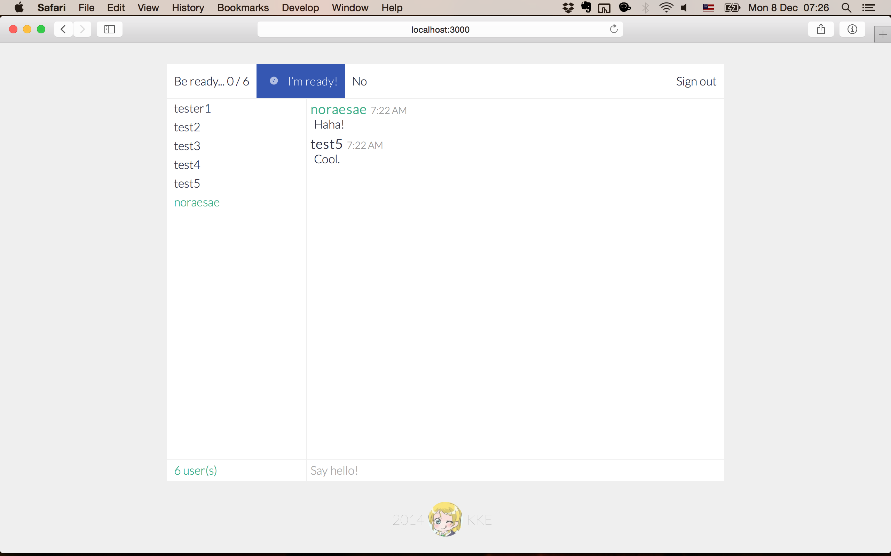
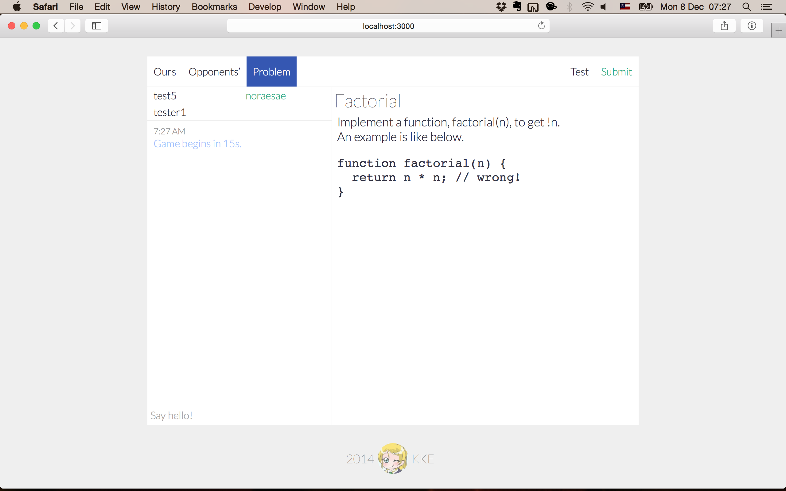
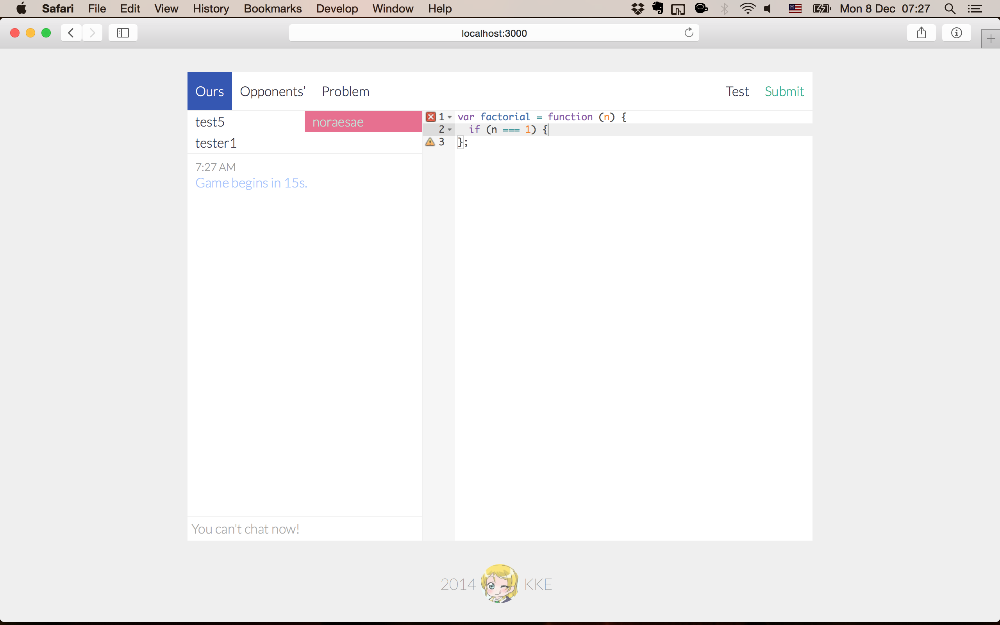
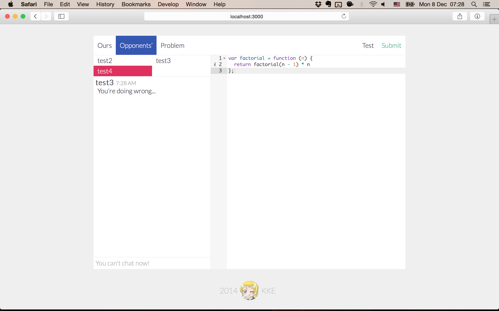
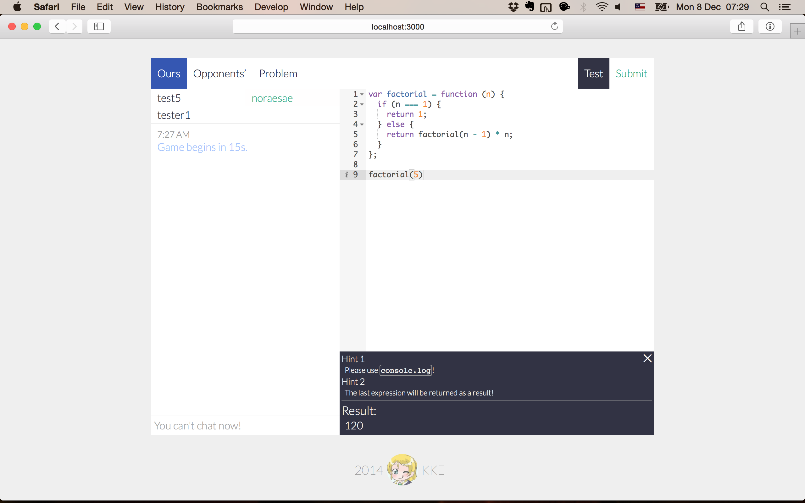
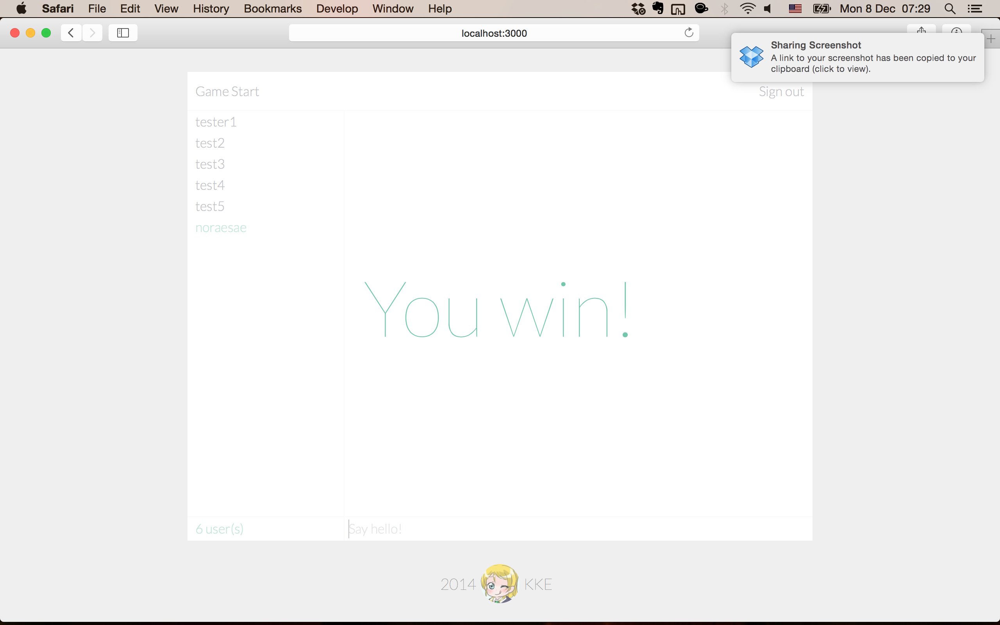

# Koding Global Virtual Hackathon's Submission

# `KKE`

Hi, we're
[`KKE`](https://github.com/koding/global.hackathon/blob/master/Teams/KKE/ABOUT.md)!

This is a page to submit our (hopefully) awesome result! While
partcipating in it, we really found it so interesting and had a nice
time. Thank you for you guys to make this precious chance.

## Description

We had enough time to choose theme for our project. We came up with the
idea that there were already lots of programming games, few of which are
interesting. The games always say that we can learn to code while
playing them. However, we've been all grown up and sometimes need to write some 
real code. We'd like to learn real code, wouldn't we?

We thought, to learn `real code`, we need to write real code. Not playing
game with special effects, moving characters or something. What we've
made is a game in which we can just write code. There's no character, no
boss, no cute things. Just IDE and test output.

Nevertheless, you can have fun with your team mates! Yes, team mates!
The bottom line is, it's a 3-on-3 live coding competition game. You are
given a problem to solve with code. You've got 15 seconds to write code.
After 15 seconds, the next team mate will continue writing code. You can
chat with others, see the live modification of your team's code, and
even check the opponents code. When your team can write the answer
faster than your opponents, you win.

As you can see, it's quite serious, but our goal is having some fun.
Writing code with someone else is always funny and we can have a really
rare but brilliant change to see how others write code. We may learn
some new things or can teach others to write better code.

Well, that's it. It's [Erichika](https://github.com/team-kke/erichika).

## Screenshots

Main page.

You can chat with friends or find a new game in a lobby menu.

When you're ready, you're ready.

Basically, we need to solve a problem.

As a team.

We can see opponents' code and chat.

We can test our code. If everything's alright, it's high time to submit!

Yay!

## Demo

If you're interested, there's a demo movie
[here](https://www.youtube.com/watch?v=gEaWfb_i7lU)!

You can also manually test it out on [Koding
VM](http://alldne.koding.io/).

## APIs used

We planned to use GitHub authentication, but we couldn't because of time
limit.

Basic tech stack is like this:

### Backend Stack
* Express
* Redis

### Frontend Stack
* Bower
* Browserify
* React
* Less

### Common Stack
* Gulp
* ESLint
* Socket.IO
